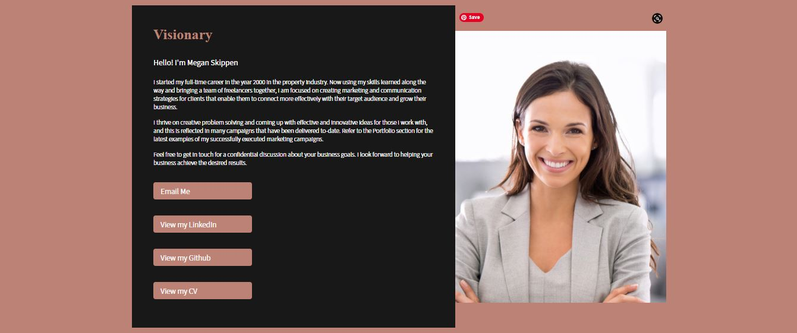

# Megan Skippen Portfolio Page

Project Agents Managing Director, Megan Skippen has developed a Portfolio Page app to provide to any clients for review of expertise and services.

# Portfolio Page
Live URL: https://mskippen.github.io/02-Advanced-CSS-Portfolio/ 

# Technologies Used
HTML, CSS

# The website
The following image shows the web application's appearance and functionality:

# License
MIT

# Collaborators
Github: https://github.com/mskippen 
Email: msmskippen@gmail.com 
Github link: https://github.com/mskippen/02-Advanced-CSS-Portfolio.git 

© 2021 Project Agents Pty Ltd. Confidential and Proprietary. All Rights Reserved.