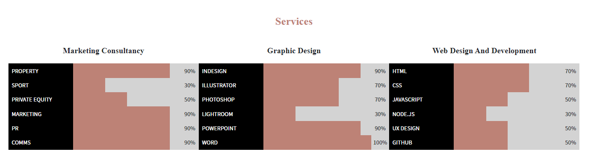
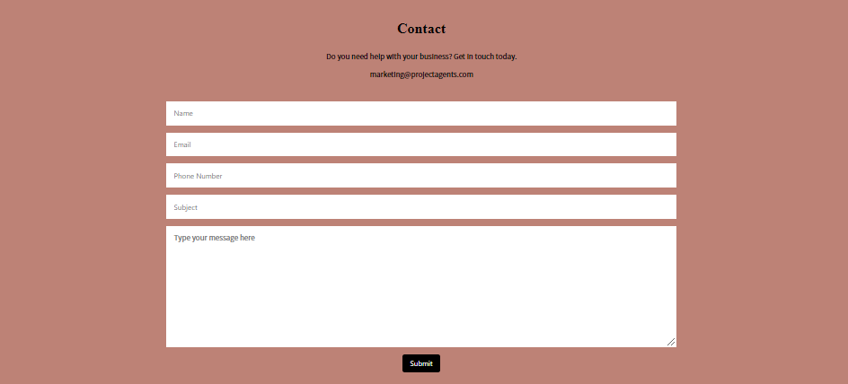

# Megan Skippen Portfolio Page

Project Agents Managing Director, Megan Skippen has developed a Portfolio Page app to provide to any clients for review of expertise and services.

# Portfolio Page
Live URL: <https://mskippen.github.io/16-Portfolio/>

# Technologies Used
HTML, CSS

# The website
The following image shows the web application's appearance and functionality:

# License
MIT

# Collaborators
Website: <https://mskippen.github.io/16-Portfolio/> 
Github link: <https://github.com/mskippen/16-Portfolio.git> 
Email: msmskippen@gmail.com 

© 2021 Project Agents Pty Ltd. Confidential and Proprietary. All Rights Reserved.